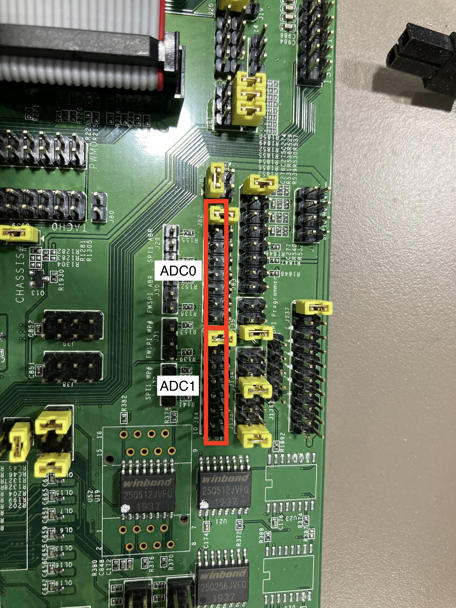

# ADC deriver demonstration
## enable ADC driver
- kconfig source: `config DEVICE_ADC` in `driver/Kconfig`
- `make menuconfig`
	- `Devices`: select `ADC device and driver`

## enable ADC demo APP
- kconfig source: `config DEMO_ADC` in `app/Kconfig`
- `make menuconfig`
	- `Demo APPs`:  select `demo ADC device`

## ADC device feature configure
- board/evb-ast2600/board_device.c
```c
/*
 * idx: Select adc index: 0 or 1
 * mv: reference voltage of adc
 * battery_ctrl: 1:Enable/0: Disable battery sensing mode (ch7)
 * cal_ctrl: 1:Enable/0:Disable calibration flow
 */
ADC_DEVICE_DECLARE(idx, mv, battery_ctrl, cal_ctrl)
/* For example:
 * ADC0: reference voltage = 2500mv, ch7 with battery sensing mode, enable calibration.
 * ADC1: reference voltage = 1200mv, ch7 with normal mode, enable calibration.
 */
ADC_DEVICE_DECLARE(0, 2500, 1, 1);
ADC_DEVICE_DECLARE(1, 1200, 0, 1);
```

## How to use adc demo command
```shell=
minibmc>help
...
adc:
        usage:
        adc command:
                adc read [index] [channel] [type]
                        [index]: 0 or 1 (required)
                        [channel]: 0~7 (required)
                        [type]: 0: mv, 1: raw data (option: default 0)
...
minibmc>adc read 0 0
1840mv
minibmc>adc read 0 0 1
754
```

## Board pin
- ADC0 channel 0~7 are at j82
- ADC1 channel 0~7 are at j84
