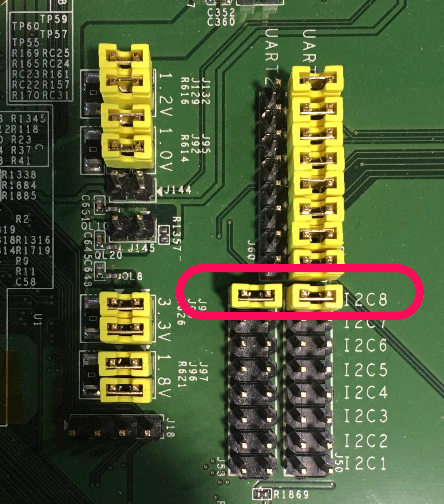

# I2C deriver demonstration
## enable I2C driver
- kconfig source: `config DEVICE_I2C` in `driver/Kconfig`
- `make menuconfig`
	- `Devices`: select `I2C device and driver`

## enable I2C demo APP
- kconfig source: `config DEMO_I2C` in `app/kconfig`
- `make menuconfig`
	- `Demo APPs`:  select `demo I2C0 access slave device`
- the I2C demo APP demonstrates how to scan I2C devices. Expected result will be

```
 xfer buf addr 103264

i2cdetect bus 7
     0  1  2  3  4  5  6  7  8  9  a  b  c  d  e  f
00: -- -- -- -- -- -- -- -- -- -- -- -- -- -- -- --
10: -- -- -- -- -- -- -- -- -- -- -- -- -- -- -- --
20: -- -- -- -- -- -- -- -- -- -- -- -- -- -- 2e --
30: -- -- -- -- -- -- -- -- -- -- -- -- -- -- -- --
40: -- -- -- -- -- -- -- -- -- -- -- -- -- -- -- --
50: -- -- -- -- -- -- -- -- -- -- -- -- -- -- -- --
60: -- -- -- -- -- -- -- -- -- -- -- -- -- -- -- --
70: -- -- -- -- -- -- --
```

## board setup
- connect I2C8 SCL and SDA
  