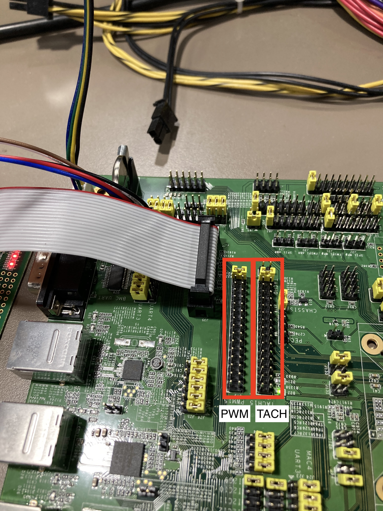

# PWM/TACH deriver demonstration
## enable PWM/TACH driver
- kconfig source: `config DEVICE_PWM_TACH` in `driver/Kconfig`
- `make menuconfig`
	- `Devices`: select `PWM/TACH device and driver`

## enable PWM/TACH demo APP
- kconfig source: `config DEMO_PWM_TACH` in `app/Kconfig`
- `make menuconfig`
	- `Demo APPs`:  select `demo PWM/TACH device`

## PWM/TACH device feature configure
- board/evb-ast2600/board_device.c
```c
/*
 * channel: Select pwm channel: 0~15
 * freq: pwm frequency, unit is Hz
 * _default_duty_ : Default pwm duty cycle: 0~100
 * reload_enable: 1:Enable/0:Disable watch dog reset reload
 * reload_duty: reload duty after watch dog reset
 */
PWM_DEVICE_DECLARE(channel, freq, _default_duty_, reload_enable, reload_duty)
/* For example:
 * PWM0: frequency is 25000Hz, default duty cycle 10%, 
 * after wdt reset pwm duty will reload to 70%
 */
PWM_DEVICE_DECLARE(0, 25000, 10, 1, 70);
```

```c
/*
 * channel: Select tach channel: 0~15
 * div: tach divide. It is recommanded to use 6.
 * pulse_pr : How many high-low pulse trains per rotation(revolution), most of the fan is 2.
 */
TACH_DEVICE_DECLARE(channel, div, pulse_pr)
/* For example:
 * TACH0: divide is 6, pulse_pr is 2, 
 */
TACH_DEVICE_DECLARE(0, 6, 2);
```
- Table of divide value and Rpm range.

tach divide 	|Max Rpm		| Min Rpm
--- 			|:---:			|:---:  
0				| 6000000000	| 5722
1				| 1500000000	| 1430
2				| 375000000		| 357
3				| 93750000		| 89
4				| 23437500		| 22
5				| 5859375		| 5
*6				| 1464843		| 1
7				| 366210		| 0
8				| 91552			| 0
9				| 22888			| 0
10				| 5722			| 0
11				| 1430			| 0
> Chose 6 to be compatible with most fan

## How to use pwm demo command
```shell=
minibmc>pwm -h
pwm:
        usage:
                [-c <channel number>]: Select pwm channel (default:0)
                [-s <duty percent>]: Set pwm duty
                [-g]: Get pwm duty
                [-i]: Get pwm status
                [-f <frequency>]: Set pwm frequecy
# get channel 1 duty
minibmc>pwm -c 1 -g
9
# set channel 1 duty
minibmc>pwm -c 1 -s 70
minibmc>pwm -c 1 -g
69
minibmc>pwm -c 1 -f 25000
```
> The duty cycle of the pwm get may have about 1% error rate .

## How to use pwm demo command
```shell=
minibmc>tach -h
tach:
        usage:
                [-c <channel number>]: Select tach channel (default:0)
                [-g]: Get tach rpm
                [-t <threshold>]: set tach threshold (unit: rpm, default: 1800)
                [-m <condition>]: set monitor condition and start monitor (0:less/1:more)
                [-i]: Get tach status
# get channel 1 rpm
minibmc>tach -c 1 -g
3070
# monitor channel 1 rpm
minibmc>tach -c 1 -t 2000 -m 1
Trigger tach threshold interrupt
```

## Board pin
- PWM channel 0~15 are at j79
- TACH channel 0~15 are at j81
